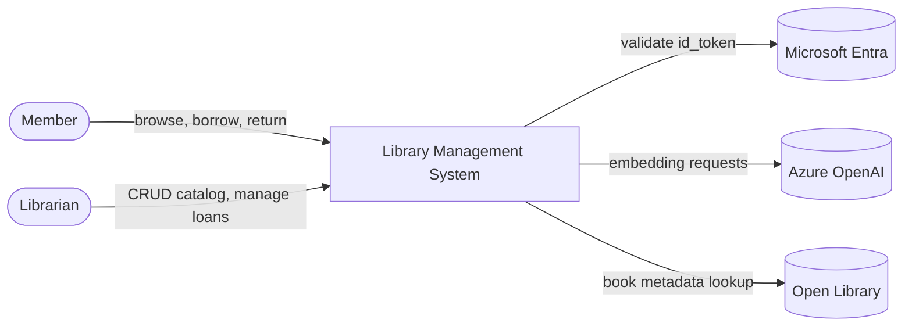
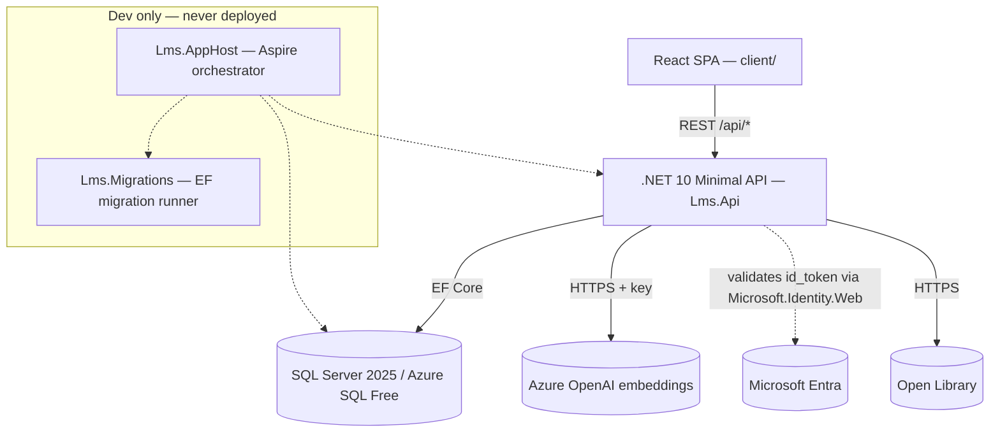
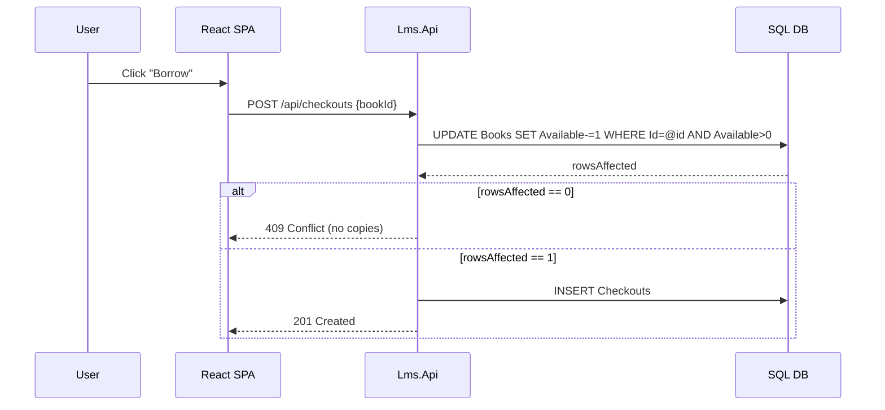
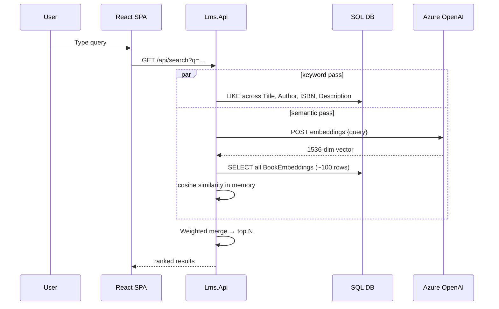
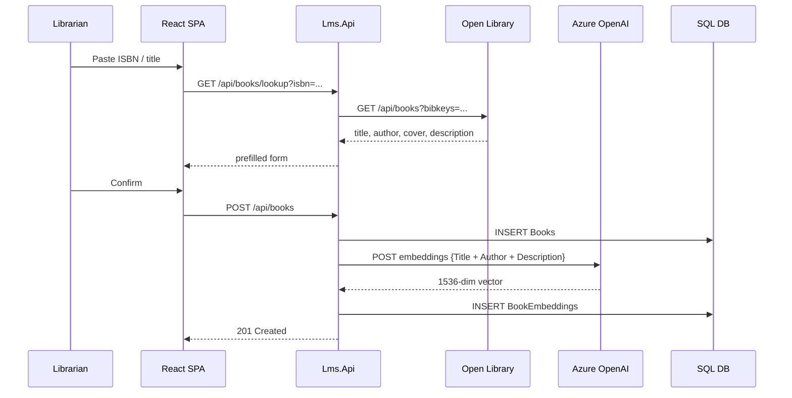
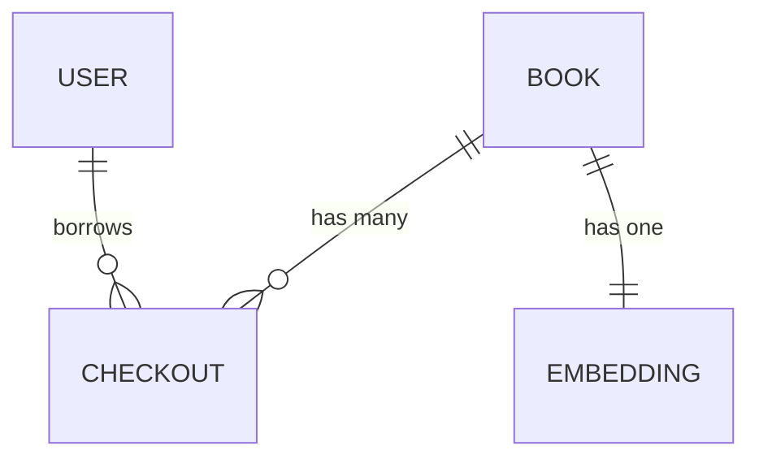
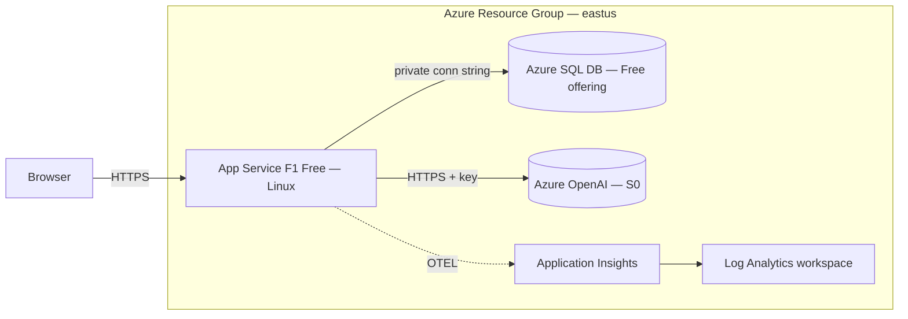

# High-Level Design — Library Management System

## 1. Metadata

| | |
|---|---|
| **Scope** | system-wide (root HLD) |
| **Status** | reviewed |
| **Date** | 2026-04-15 |
| **Parent** | — (this is the root HLD) |
| **Child LLDs** | populated under `.claude/docs/LLD/` as components are implemented |
| **Related** | `REQUIREMENTS.md`, `DB-SCHEMA.md`, `INVARIANTS.md` |

## 2. Context

A Mini Library Management System. **Members** browse a catalog, borrow and return books. **Librarians** manage the catalog and oversee loans. The system runs on Azure free tiers — target cost **$0/month**. The same codebase runs locally and in Azure; only the configuration source changes.

## 3. Goals and Non-goals

**Must-have (FR-1..FR-3):**
- Full book CRUD with soft delete (preserves loan history)
- Atomic checkout / check-in with due-date tracking
- Full-text + filter + sort search across the catalog

**Should-have (FR-4..FR-5):**
- Dashboard with stats and recent activity
- Toasts, form validation, loading/error/empty states

**Bonus (FR-6..FR-8):**
- Microsoft Entra SSO with Member / Librarian roles
- Natural-language semantic search via Azure OpenAI embeddings
- Live Azure deployment with GitHub Actions CI/CD

**Non-goals:**
- Horizontal scale-out — a single F1 instance is the explicit target
- Multi-tenancy — one library, one catalog
- Background job framework — no workloads justify one
- Refresh token rotation — 8h JWT then re-sign-in
- Per-copy tracking — the `AvailableCopies` counter on `Books` is sufficient
- Key Vault, Managed Identity for SQL, Container Apps, `pgvector`, BFF pattern, Dapper, vertical slice architecture — see §10 Trade-offs for why each was rejected

## 4. System context diagram ◆



**Members** sign in via Entra to borrow/return. **Librarians** have full CRUD on the catalog and can manage any loan. **Microsoft Entra** is the identity provider (common tenant; personal + work/school accounts). **Azure OpenAI** hosts a `text-embedding-3-small` deployment (1536-dim vectors). **Open Library** is a read-only data-entry convenience returning book metadata given an ISBN or title — the local database owns the catalog.

## 5. Container / component diagram ◆



**React SPA** renders the UI and owns all client state (React 18 + Vite + TypeScript, `@azure/msal-react` for sign-in, React Router for nav, TanStack Query for server state). **Lms.Api** is the sole backend — serves `/api/*` and the compiled SPA from `wwwroot` in prod (invariant #7). **SQL Server** holds the four tables in `DB-SCHEMA.md`. **Lms.Migrations** is a dedicated console that applies EF migrations; it never runs from inside `Lms.Api` (invariant #1). **Lms.AppHost** is the local orchestrator — runs the SQL container, migrations, API, and Vite dev server in one `dotnet run`; it is never built or deployed (invariant #8).

### Repo layout

```
lms/
├── client/                    React SPA (Vite + TS)
│   └── src/{api,components,pages,hooks,types}
├── src/
│   ├── Lms.AppHost/           Aspire orchestrator (dev-only)
│   ├── Lms.ServiceDefaults/   shared OTEL + health-check config
│   ├── Lms.Domain/            entities, value objects, repository interfaces
│   ├── Lms.Application/       use-case services, DTOs
│   ├── Lms.Infrastructure/    LmsDbContext, fluent configs, concrete repositories, external integrations
│   ├── Lms.Api/               Minimal API; serves wwwroot in prod; DI composition root
│   │   └── {Endpoints, Auth, wwwroot}
│   └── Lms.Migrations/        EF migration runner (prod CI + local Aspire)
├── azure/main.bicep           Resource Group provisioning
├── .github/workflows/         CI/CD (single deploy.yml)
└── Lms.slnx
```

The solution uses **Clean Architecture with layered projects** (invariant #9): `Lms.Domain` holds entities and repository interfaces; `Lms.Application` holds use-case services (which take `IBookRepository` / `IUserRepository` / `ICheckoutRepository` via DI); `Lms.Infrastructure` holds `LmsDbContext`, fluent configurations, concrete repositories, and external integrations (Open Library, Azure OpenAI); `Lms.Api` holds Minimal API endpoints, authentication, DI composition, and serves the compiled React SPA from `wwwroot` in production. Dependencies flow inward only — a reverse reference is an MSBuild error.

## 6. Key flows ◆

### 6.1 Sign-in

```mermaid
sequenceDiagram
    participant U as User
    participant S as React SPA
    participant A as Lms.Api
    participant E as Microsoft Entra

    U->>S: Click "Sign in"
    S->>E: MSAL redirect (PKCE)
    E-->>S: id_token
    S->>A: POST /api/auth/login {id_token}
    A->>E: Validate token via Microsoft.Identity.Web
    E-->>A: ok + oid, email, name claims
    A->>A: Upsert Users by oid; issue 8h JWT with role claim
    A-->>S: {app_jwt}
```

MSAL drives the PKCE redirect. The API validates the `id_token` via `Microsoft.Identity.Web`, upserts the `Users` row keyed by the Entra `oid`, then mints its **own 8-hour JWT** signed with a local symmetric key. Every subsequent `/api/*` call carries the app JWT; the Entra token is never reused. For demo convenience, the first user to sign in is auto-promoted to Librarian.

### 6.2 Checkout — atomic compare-and-set (invariant #3)



Two concurrent borrows of the last copy see exactly **one** `rowsAffected == 1` and **one** `rowsAffected == 0`. The loser gets 409. The `CK_Books_Copies >= 0` CHECK constraint is the backstop, not the primary mechanism. Return is the mirror: set `ReturnedAt`, increment `AvailableCopies`, commit.

### 6.3 Hybrid search — keyword + semantic (invariant #5)



At ~100 books the in-memory cosine scan takes <1ms — faster than any round-trip to a managed vector store. An embedding is generated once per book and stored as a `VARBINARY` blob in `BookEmbeddings` along with `ModelName` + `Dimensions` so model changes can be detected and trigger re-embedding.

### 6.4 Adding a book (Open Library lookup)



Open Library is a data-entry convenience; the catalog itself is owned by the local database. Embedding generation is synchronous on book insert so the book is immediately discoverable by semantic search.

## 7. Data flow and storage ◆



**Books** is read-heavy and hot — every search and detail-page hit touches it. **Checkouts** is append-mostly (insert on borrow, update `ReturnedAt` on return). **Users** is tiny, grows with sign-ins, contains PII (email, display name). **BookEmbeddings** is write-once per book, read on every semantic search (~1536 floats × ~100 rows ≈ 600 KB in memory).

Column-level DDL and constraints live in `.claude/docs/DB-SCHEMA.md`. EF Core with the SqlServer provider is the only data access path. A single `LmsDbContext` in `Data/` exposes a `DbSet` per entity. Services take `LmsDbContext` as a dependency and use it directly — no repository layer (invariant #2).

## 8. Deployment topology ◆



One Resource Group, one region (eastus), one App Service hosting **both** the React SPA (from `wwwroot`) and the API at `/api/*` (invariant #7). Everything provisioned by `azure/main.bicep` at resource-group scope. Two resources are deliberately **not** in Bicep: the Entra app registration (tenant-scoped, created by hand) and GitHub repository secrets (one-time manual setup).

### CI/CD pipeline

```mermaid
flowchart LR
    Push[push to main] --> Build[npm ci + npm run build]
    Build --> Copy[copy dist/ → Lms.Api/wwwroot]
    Copy --> Publish[dotnet publish Lms.Api]
    Publish --> Mig[run Lms.Migrations against Azure SQL]
    Mig --> Deploy[azure/webapps-deploy@v3]
```

A single GitHub Actions workflow on push to `main`. End-to-end build + deploy ≈ 4 minutes. `Lms.Migrations` runs **before** the deploy swap — the new schema is ready when the new code lands. `Lms.AppHost` is never built or deployed (invariant #8).

### Cost

| Resource | SKU | Monthly |
|---|---|---|
| App Service Plan | F1 Free Linux | $0 |
| Azure SQL Database | Free offering | $0 |
| Azure OpenAI | S0 (demo usage) | ~$0 |
| Application Insights | First 1 GB free | $0 |
| Microsoft Entra | Included | $0 |
| **Total** | | **$0** |

Worst case if SQL Free is unavailable and App Service drops to B1: ~$18/month.

## 9. Non-functional requirements

| Concern | Target | Measurement |
|---|---|---|
| Availability | 99.0% monthly (F1 has no SLA) | Azure Monitor uptime |
| Latency p50 / p95 | 300ms / 800ms (post cold start) | OTEL traces in App Insights |
| Throughput | 5 req/s sustained (demo scale) | App Service metrics |
| Security | Entra SSO, HTTPS-only, CSP headers, parameterized SQL | `security-review` skill |
| Observability | OTEL → App Insights; `/api/health` reports DB + version | Synthetic probe |
| Cost ceiling | $0/month | Azure Cost Management alert |

Observability: the Aspire Dashboard surfaces logs/traces/metrics locally over OTEL. In production the same exporters point at Application Insights — the telemetry shape is identical. `Lms.ServiceDefaults` owns the OTEL setup and health-check registration; both `Lms.Api` and `Lms.Migrations` reference it.

## 10. Trade-offs and alternatives considered

- **In-memory cosine similarity** (chosen) vs. `pgvector` / Azure AI Search / Pinecone (rejected). At ~100 books, in-memory is faster than any network round-trip and adds zero infra cost. Upgrade path is documented if the catalog grows.
- **Single App Service hosts SPA + API** (chosen) vs. Static Web Apps + Container Apps split (rejected). Splitting breaks the free-tier budget and adds deploy coordination. SPA build lives in `wwwroot`.
- **EF Core + SqlServer + layered projects with repository pattern** (chosen, invariant #9) vs. DbContext-direct in services (originally chosen as #2, now retired) vs. Dapper (rejected). The dependency-arrow discipline is worth the indirection cost at this scale: invariant #3's atomic CAS has a natural home in `ICheckoutRepository.TryCheckoutAsync`, the Clean Architecture shape is easier to review than a folder-layered monolith, and the MSBuild project-reference graph enforces the layering for free. Dapper was rejected because EF Core's fluent configurations capture the non-trivial column types (`NVARCHAR(500)` vs default `NVARCHAR(MAX)`, `DATETIME2` vs `DATETIME`, `CK_Books_Copies`) declaratively — hand-writing that SQL is error-prone.
- **JWT + SPA (stateless)** (chosen) vs. cookie + BFF (rejected). Simpler; secure at this scale and threat model.
- **Dedicated `Lms.Migrations` console** (chosen, invariant #1) vs. `Database.Migrate()` at API startup (rejected). Race safety on CI/CD swap; explicit deploy step; enforced by the `pre-edit-migration-detector` hook.
- **App Service Configuration** (chosen) vs. Azure Key Vault (rejected). Sufficient for secrets at this scale; Key Vault flagged as the production hardening step.
- **Password auth for SQL** (chosen) vs. Managed Identity (rejected). Simpler in both environments; MI flagged as the production hardening step.
- **Standard layered organization** (chosen) vs. vertical slice / feature folders (rejected). At ~5 features the cognitive win of slicing does not justify the organizational churn; layered is more recognizable to a reviewer and equally maintainable at this scale.
- **8h JWT, no refresh rotation** (chosen) vs. rotating refresh tokens (rejected). Acceptable for a demo; noted as a hardening step.
- **Horizontal scale-out not supported** — single F1 instance is the explicit target. No load balancer, no session affinity concerns.

### Configuration and secrets

The same code reads configuration through `IConfiguration`. Locally values live in .NET user secrets or `appsettings.Development.json` (gitignored). In production the same keys are set as App Service Configuration Application Settings, exposed as environment variables. Invariant #6: same keys, different source.

| Setting | Local | Production |
|---|---|---|
| Database connection string | User secrets | App Service Configuration |
| Entra client ID / authority | User secrets | App Service Configuration |
| Azure OpenAI endpoint / key | User secrets | App Service Configuration |
| JWT signing key | User secrets | App Service Configuration |

## 11. Risks and open questions

**Risks:**
- **Azure OpenAI cold start** — first query of the day after the deployment pauses; may show 5–10 s latency. Mitigation: skeleton UI on first search.
- **SQL Free auto-pause + 32 GB cap** — first query of the day pays a wake tax; combined with App Service cold start, worst-case ~10 s.
- **F1 SLA is zero** — Azure reserves the right to restart. Acceptable for a demo, not for production.
- **Entra app registration is manual** — tenant-scoped; not in Bicep. Loss of the registration requires manual re-creation.
- **Single region, no failover** — region outage = full outage. Acceptable at demo scale.

**Open questions:**
- Which bonus features land in v1 (recommendation: FR-6 SSO + FR-7.1 semantic search + FR-8 deploy).
- Embedding regeneration policy on book edit — every edit, or only when title/author/description changes?
- Cache Open Library lookup responses in DB to reduce repeat outbound calls during demo seeding — worth it or premature?
- Final shape of the JWT claim set — how are display name and email passed to the frontend?
- Mask Azure OpenAI cold-start latency in the search UI on the very first query after deploy — how?
- Include an xUnit integration-test project against the SQL container in initial scope, or defer?

## 12. Links

- **Requirements:** `.claude/docs/REQUIREMENTS.md` (FR-1..FR-8)
- **Database schema:** `.claude/docs/DB-SCHEMA.md` (four tables, column-level DDL)
- **Architecture invariants:** `.claude/docs/INVARIANTS.md` (numbered, cited throughout this HLD)
- **Low-level designs:** `.claude/docs/LLD/*.md` — added as components are implemented
- **Feature HLDs** (if needed): `.claude/docs/HLD-<feature>.md` alongside this file
