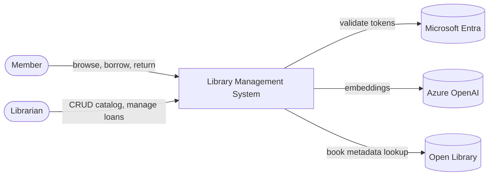
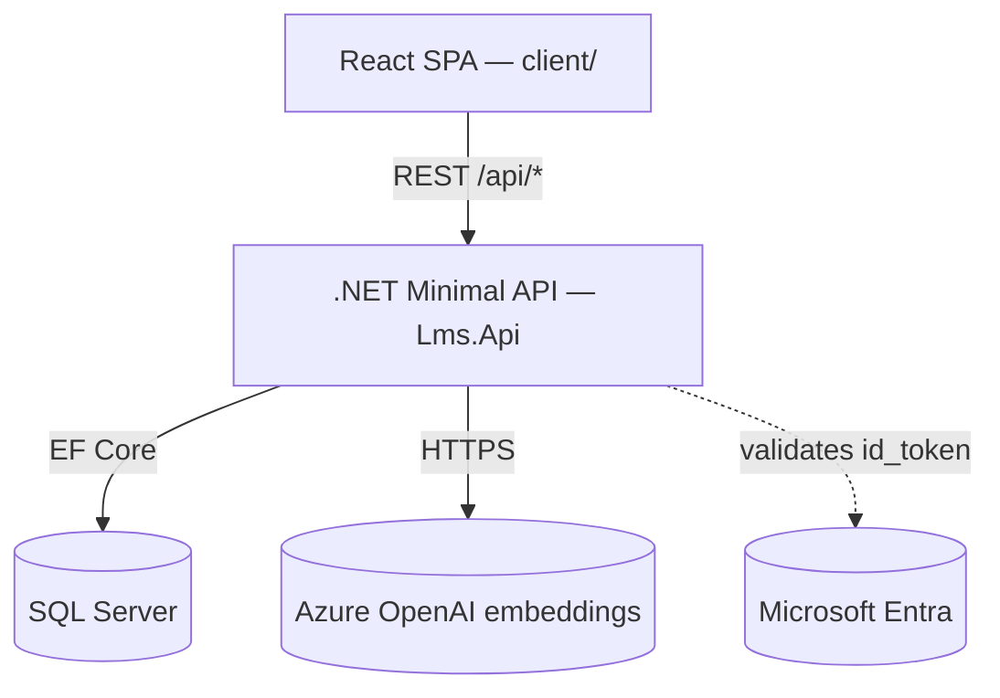
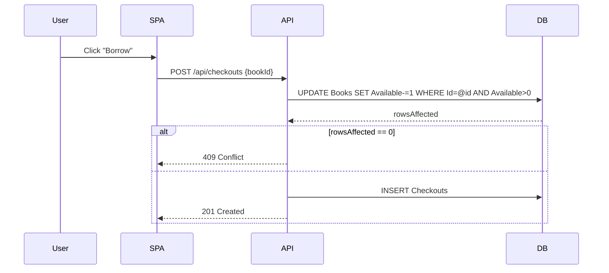
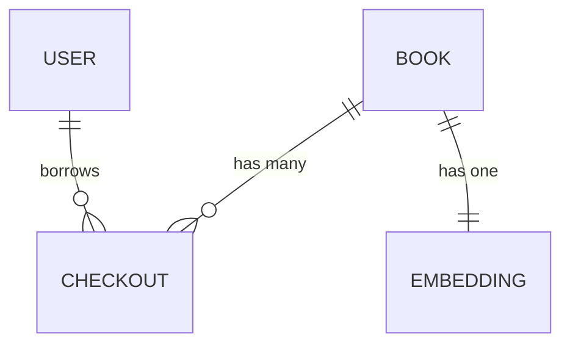
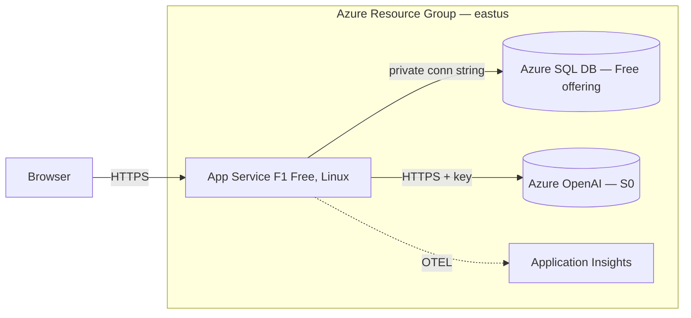

# High-Level Design (HLD) Skill

Produce a feature-level or system-level HLD that a new engineer can read in 10 minutes and understand the whole shape of the system. **Diagrams lead; prose supports.** If you catch yourself writing three paragraphs without a diagram, you're in LLD territory — push that detail down.

## When this skill fires

- User says: "write an HLD", "design doc", "architecture doc", "document this at high level", "system overview", "HLD for X"
- A worker is about to start implementation and has no system-level view
- A feature spans >2 components and needs a shared mental model before the LLD

## Output location

HLDs are **flat files** under `.claude/docs/` — there is no `HLD/` subdirectory.

- **System-wide HLD:** `.claude/docs/HLD.md` (exactly one per project)
- **Feature HLD:** `.claude/docs/HLD-<feature-slug>.md` (one per feature that needs its own design doc)
- Naming: kebab-case for the feature portion (e.g. `HLD-checkout-flow.md`, `HLD-semantic-search.md`)

If the system HLD `.claude/docs/HLD.md` already exists, **update it** rather than creating a duplicate. Most projects need exactly one HLD; reach for a feature HLD only when a feature spans multiple components and its design decisions don't fit cleanly inside the system HLD.

## Required structure — follow this order exactly

Every HLD MUST have these sections in order, with at least one Mermaid diagram in the sections marked **◆**.

### 1. Metadata
Author, date, status (`draft` / `reviewed` / `implemented`), related docs (parent HLD if any, child LLDs), linked issues.

### 2. Context
One paragraph, ≤4 sentences. *What* problem, *who* uses it, *why now*. No solutioning.

### 3. Goals and Non-goals
Two bullet lists. Goals are testable outcomes. Non-goals are deliberate exclusions — protects against scope creep during review.

### 4. System context diagram ◆
The system is a **black box** with external actors around it. Use `flowchart LR` or C4-style notation.

One paragraph (≤5 sentences) naming each actor and its relationship.

### 5. Container / component diagram ◆
Break the system from §4 into its major runtime components. Show direction and purpose of each arrow.

One short paragraph per container: what it does, why it exists. No implementation detail.

### 6. Key flows ◆
2-4 Mermaid `sequenceDiagram`s for the critical user journeys. Each ≤10 participants, ≤15 messages.

One paragraph per flow explaining the non-obvious parts (concurrency, idempotency, failure modes).

### 7. Data flow and storage ◆
High-level ER diagram at **entity level only** — NO column detail, that's LLD territory.

One paragraph on data temperature: which entities are read-heavy, write-heavy, hot, cold, contain PII.

### 8. Deployment topology ◆
Where each container runs in production. Region, tier, scaling assumptions, cost ceiling.

### 9. Non-functional requirements
Table — fill every row. Missing NFRs = unreviewable.

| Concern | Target | Measurement |
|---|---|---|
| Availability | 99.5% monthly | Azure Monitor uptime |
| Latency (p50 / p95) | 200ms / 500ms | OTEL traces |
| Throughput | 10 req/s sustained | App Service metrics |
| Security | Entra auth, HTTPS-only, CSP headers | Security review skill |
| Observability | OTEL → App Insights; `/api/health` | Synthetic probe |
| Cost ceiling | $0/month | Azure Cost Management |

### 10. Trade-offs and alternatives considered
Bulleted list of the 2-5 biggest decisions. For each: **what was chosen**, **what was rejected**, **why**. This pre-empts "why not X?" review comments and serves as an inline ADR.

- **Chosen:** in-memory cosine similarity for semantic search. **Rejected:** pgvector, Azure AI Search. **Why:** at ~100 books, in-memory is faster than any network round-trip and adds zero infra.

### 11. Risks and open questions
Two bullet lists.
- **Risks:** what could fail in production (e.g. Azure OpenAI cold start on first query, SQL Free 32GB limit).
- **Open questions:** what still needs decision before LLD (e.g. Open Library caching, embedding regeneration policy).

### 12. Links
- LLDs that implement this HLD: `.claude/docs/LLD/<component>.md`
- Parent HLD (if this is a feature-level one): `.claude/docs/HLD.md`
- Invariants referenced: `.claude/docs/INVARIANTS.md` by number

## Style rules

- **Mermaid only — never ASCII art, never PNG.** Docs must render in GitHub and stay diff-friendly.
- **Budget: 200 lines max per HLD.** Longer = split by feature or move detail to LLD.
- **No pseudocode.** That's LLD.
- **No class names or column names.** Use container / service names only.
- **One system boundary per HLD.** Multiple systems = multiple HLDs.
- **Cite invariants by number** from `.claude/docs/INVARIANTS.md` (e.g. "Per invariant #1, migrations run out-of-band").
- **Never duplicate** `.claude/docs/HLD.md` — reference it instead.

## Anti-patterns

- Copy-pasting `HLD.md` verbatim — synthesize for the specific feature
- Deep class diagrams — belongs in LLD
- Actual code — belongs in LLD
- Skipping "Alternatives considered" — reviewers always ask
- Skipping the NFR table — no targets = unreviewable
- Writing the HLD *after* implementing — loses the design-review value

## Big-tech conventions this follows

- **C4 model** (Simon Brown): §4 = context, §5 = container/component. We skip the Code level — that's LLD.
- **Google design doc template**: Context, Goals/Non-goals, Overview, Detailed design (via links to LLDs), Alternatives considered, Risks.
- **ADR (Architecture Decision Records)**: §10 is an inline ADR for the feature's top decisions.
- **Mermaid-first**: same rationale as GitHub engineering docs — version control, review-friendly, no toolchain lock-in.

## Integration with the dispatch system

When a worker is dispatched to produce an HLD:
1. Read `.claude/docs/HLD.md` first for project-wide context
2. Read `.claude/docs/INVARIANTS.md` and note applicable numbers
3. Check if an HLD already exists at the target path — update instead of duplicate
4. Produce the file
5. Report in ≤100 words: file path, sections produced, any open questions raised
