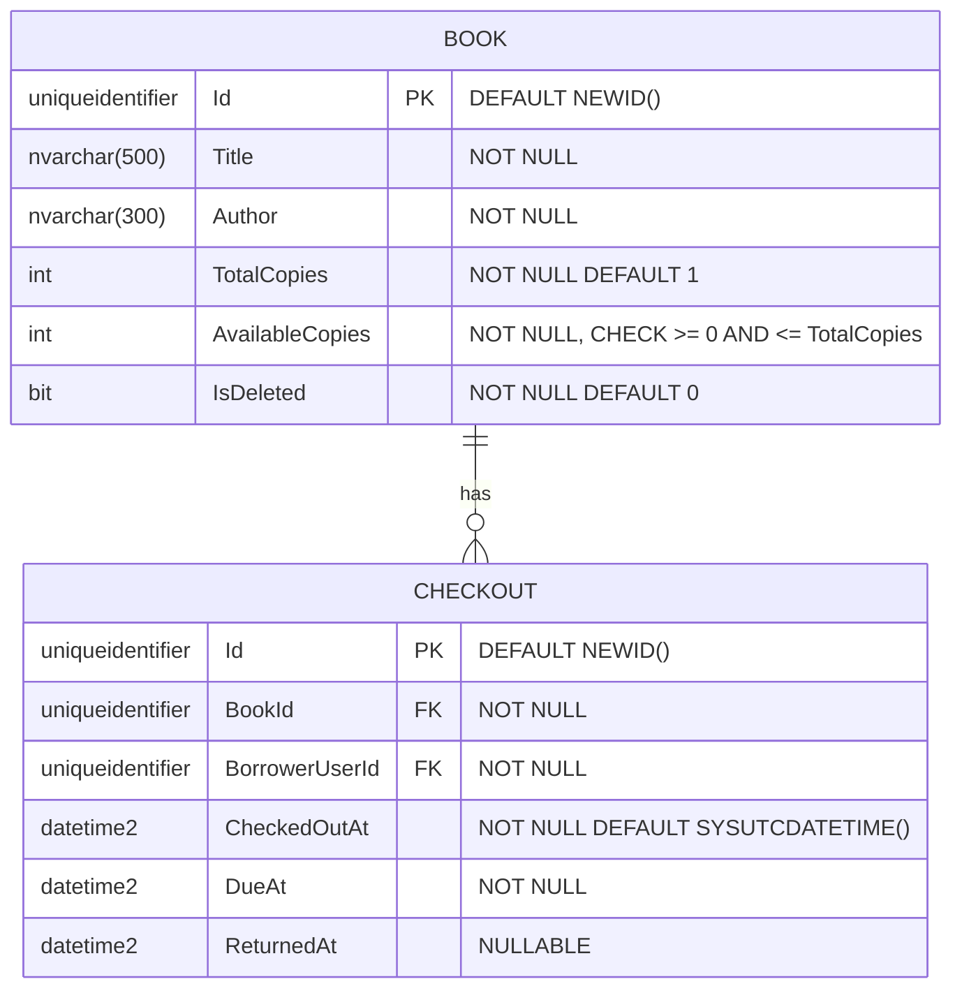
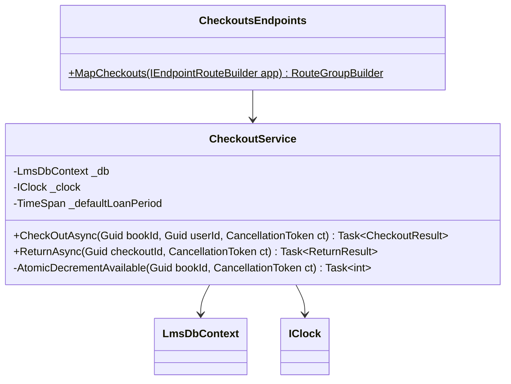
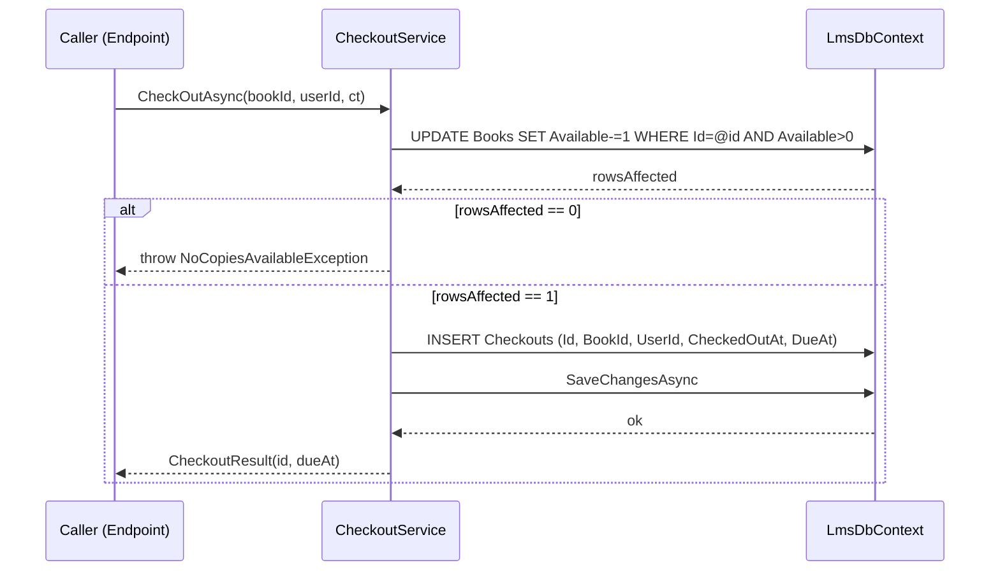
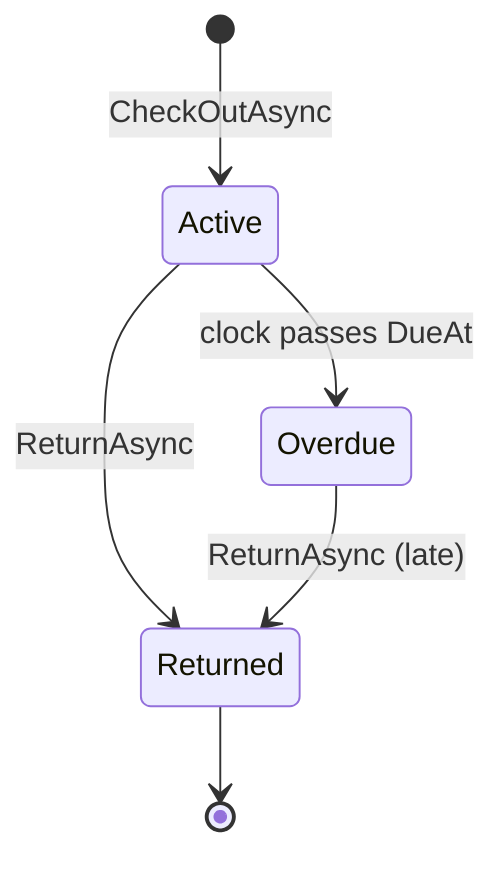

# Low-Level Design (LLD) Skill

Produce a component-level LLD that an implementation worker can follow without making further design decisions. An HLD says *what*; the LLD says *exactly how*.

**Diagrams carry the structural load. Prose fills in preconditions, invariants, and failure modes that diagrams can't express.**

## Prerequisite

A parent HLD must exist. In order of preference:
1. **Feature HLD** at `.claude/docs/HLD-<feature>.md` — if the LLD covers a feature with its own design doc.
2. **Root HLD** at `.claude/docs/HLD.md` — for components that descend directly from the system HLD.

If neither exists, **STOP** and produce the HLD first. LLDs without an HLD become undisciplined implementation notes and review breaks down.

## When this skill fires

- User says: "write an LLD", "detailed design", "implementation plan", "API spec", "data model", "class diagram", "document X in detail"
- A worker is about to start coding and the HLD is too abstract to implement from
- A component has non-trivial state, concurrency, or error handling that deserves its own doc

## Output location

- `.claude/docs/LLD/<component-slug>.md`
- Naming: kebab-case derived from the component (e.g. `checkout-service.md`, `book-embedding-service.md`)

Create the `.claude/docs/LLD/` directory if missing.

## Required structure — follow this order exactly

### 1. Metadata
Author, date, status, parent HLD path, linked issues/PRs.

### 2. Scope
One paragraph. Which component(s) of the HLD this LLD covers, and what's explicitly out of scope (e.g. "covers `CheckoutService` and `CheckoutsEndpoints`; does NOT cover return flow — see `return-flow.md`").

### 3. API contract
For **every endpoint** the component exposes, document:

- **Method + path** — literal route
- **Auth** — required role / policy attribute
- **Request body** — JSON example, not OpenAPI YAML
- **Response body** — success shape as JSON
- **Status codes** — every one the endpoint can return, with root cause per code
- **Idempotency** — yes/no; idempotency-key handling if applicable
- **Rate limits** — if any

Example:

```
POST /api/checkouts
Auth: [Authorize(Policy = "Member")]

Request:
{ "bookId": "guid" }

Response 201 Created:
{ "checkoutId": "guid", "dueAt": "2026-04-29T00:00:00Z" }

Status codes:
  201 — checkout created
  400 — malformed request body
  401 — missing / invalid token
  403 — user is not a member
  404 — book not found or soft-deleted
  409 — AvailableCopies == 0 (race loser OR sold out)
  500 — unexpected (logged, generic message returned)

Idempotent: NO
Rate limit: 10/min per user
```

### 4. Data model ◆
Mermaid `erDiagram` at **column granularity** — every column has type, nullability, default, constraints.



Follow with a **data invariants** bullet list — every invariant enforced at the DB or service layer:

- `Books.AvailableCopies >= 0` (CHECK constraint `CK_Books_Copies`)
- `Books.AvailableCopies <= TotalCopies` (same CHECK)
- `Checkouts` is the source of truth for loan state — status is **computed** from `ReturnedAt` + `DueAt`, never stored
- Loans for deleted books are preserved (soft delete)

### 5. Class / module structure ◆
Mermaid `classDiagram` for the component's main types. Show public methods with signatures. Omit method bodies.



Bullet list describing each public method: preconditions, post-conditions, side effects, exceptions thrown.

### 6. Sequence diagrams per operation ◆
**One Mermaid `sequenceDiagram` per public method.** Show every DB call, external service call, emitted event. Include the failure path when it differs from success.



### 7. State machine (when applicable) ◆
If the component manages an entity with a non-trivial lifecycle, include a `stateDiagram-v2`. Annotate transitions with the event that causes them.



Explicitly note: **Overdue is a computed state, not a stored column** (per invariant #4).

### 8. Error handling
Table — every exception the component can throw, where it's caught, and how it maps to HTTP.

| Exception | Thrown from | Caught by | HTTP mapping |
|---|---|---|---|
| `BookNotFoundException` | `CheckoutService` | Endpoint | 404 |
| `NoCopiesAvailableException` | `CheckoutService` | Endpoint | 409 |
| `ValidationException` | Endpoint binding | ASP.NET pipeline | 400 |
| `DbUpdateException` | EF Core | Service → Endpoint | 500 (log with correlation id) |

### 9. Concurrency & transactions
- **Transaction scope**: where it begins, where it commits, what rolls back
- **Isolation level**: default (READ COMMITTED) unless stated otherwise
- **Race conditions & their mitigation**: explicitly describe each race and its compare-and-set / row-lock / idempotency-key defense. Reference invariant numbers.
- **Idempotency keys**: yes/no and handling if yes

Example: *"Checkout is protected by the atomic compare-and-set at the DB layer (invariant #3). Two concurrent `POST /api/checkouts` for the same last copy will see exactly one `rowsAffected == 1` and one `rowsAffected == 0`; the loser receives a 409."*

### 10. Testing strategy
- **Unit tests** (`tests/Lms.Api.Tests/Checkout/CheckoutServiceTests.cs`):
  - Happy path: single checkout on a book with available copies
  - Edge: checkout when `AvailableCopies == 0` → `NoCopiesAvailableException`
  - Edge: concurrent checkout race (two services, one succeeds, one throws)
  - Edge: checkout of soft-deleted book → `BookNotFoundException`
- **Integration tests** (`tests/Lms.Api.IntegrationTests/CheckoutFlowTests.cs`):
  - Full POST /api/checkouts with real SQL Server container
  - Auth policy enforcement (401 for anon, 403 for non-members)
- **E2E tests** (`tests/Lms.E2E/CheckoutJourney.spec.ts`, optional):
  - Member logs in → browses → borrows → confirms "My Loans" updated

State the **coverage target**: 80% of new lines, per `.claude/rules/base-testing.md`.

### 11. Implementation checklist
A flat bullet list the implementation worker literally ticks off:

- [ ] Create `src/Lms.Api/Dtos/CheckoutRequest.cs` (record)
- [ ] Create `src/Lms.Api/Dtos/CheckoutResponse.cs` (record)
- [ ] Create `src/Lms.Api/Services/CheckoutService.cs`
- [ ] Create `src/Lms.Api/Endpoints/CheckoutsEndpoints.cs`
- [ ] Create `tests/Lms.Api.Tests/Checkout/CheckoutServiceTests.cs`
- [ ] Create `tests/Lms.Api.IntegrationTests/CheckoutFlowTests.cs`
- [ ] Register `CheckoutService` in `Program.cs` via `AddScoped`
- [ ] Register endpoint group in `Program.cs` via `app.MapCheckouts()`
- [ ] Run `dotnet test` — all green
- [ ] Run `superpowers:verification-before-completion` gate

### 12. Links
- Parent HLD: `.claude/docs/HLD-<feature>.md`
- Invariants cited: `#1, #3, #4` (see `.claude/docs/INVARIANTS.md`)
- Rules applied: `.claude/rules/sql-server-patterns.md`, `.claude/rules/testing-cs.md`, `.claude/rules/efcore-patterns.md` *(if the rules index names it)*

## Style rules

- **Every non-trivial operation gets a sequence diagram.** If you can describe it in one sentence, skip.
- **No ambiguity in the data model section.** Every column has type, nullability, default, constraint.
- **API contract uses literal examples.** A reader should be able to `curl` from the doc alone.
- **Budget: 300 lines max per LLD.** Longer = split by component or push to sub-LLDs.
- **No real code.** Pseudocode OK; real C# / TypeScript is not. The worker writes real code.
- **Cite invariants by number** — never re-state them.
- **Test strategy is not optional.** An LLD without a testing section is incomplete.

## Anti-patterns

- Implementation code inline — this doc is a *contract*, not a patch
- Skipping sequence diagrams because "it's obvious" — if it touches the DB or an external service, include it
- Forgetting error codes — every endpoint enumerates every status code it returns
- Duplicating HLD content — link, don't restate
- Skipping state machine when an entity has a lifecycle
- Leaving the implementation checklist vague — "implement checkout" is not a task; every checkbox must be completable in ≤30 min

## Big-tech conventions this follows

- **UML class / sequence / state diagrams** via Mermaid (GitHub-renderable, diff-friendly, no toolchain lock-in)
- **Per-endpoint API contract** matching the `curl`-able style used by Stripe / GitHub API docs
- **C4 Code level** (deepest level of Simon Brown's C4 model) — this is where HLD hands off
- **Test strategy section** mandatory — follows Google Testing on the Toilet / Microsoft STE traditions

## Integration with the dispatch system

When a worker is dispatched to produce an LLD:
1. Read the parent HLD at `.claude/docs/HLD-<feature>.md` — if missing, STOP and ask the team lead
2. Read `.claude/docs/INVARIANTS.md` and cite applicable numbers
3. Read the project rules files listed in the toolkit catalog under "Data", "Testing", and "Backend/Frontend implementation" (as relevant)
4. Check if an LLD already exists at the target path — update instead of duplicate
5. Produce the file
6. Report in ≤100 words: file path, component covered, number of operations documented, any items flagged for the team lead
